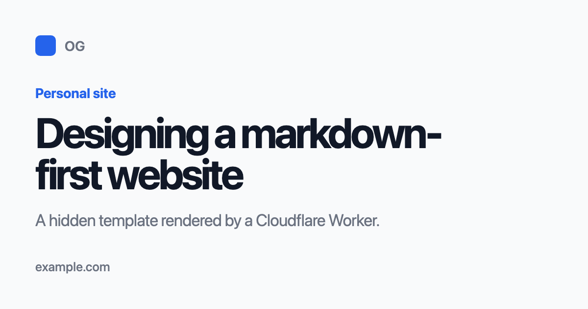
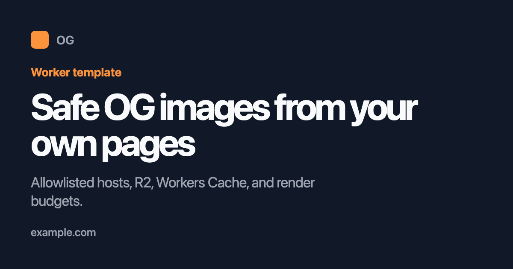
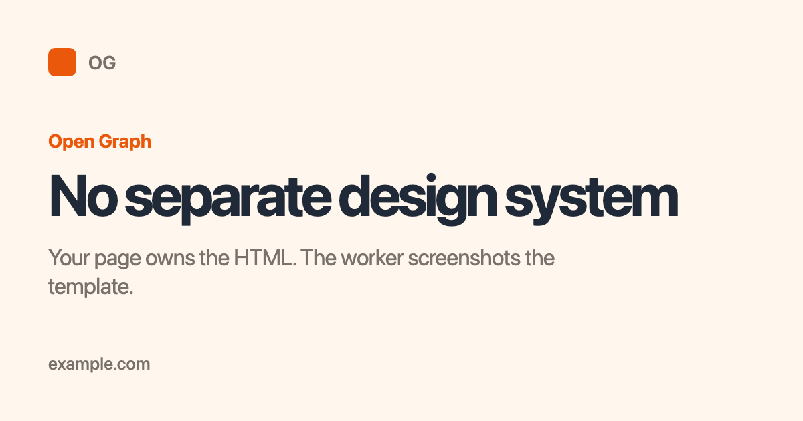
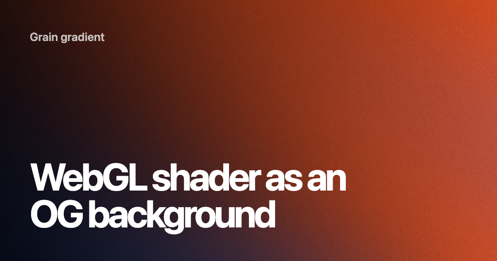

<p align="center">
  <strong>OG</strong>
</p>

<p align="center">
  A self-hosted Cloudflare Worker for rendering cached Open Graph images from your own site.
</p>

<p align="center">
  <a href="https://github.com/iannuttall/og/actions"></a>
  <a href="https://github.com/iannuttall/og/blob/main/LICENSE"></a>
  <a href="SECURITY.md"></a>
  <a href="https://workers.cloudflare.com/"></a>
</p>

<p align="center">
  <a href="https://deploy.workers.cloudflare.com/?url=https://github.com/iannuttall/og"></a>
</p>

## What it does

This Worker takes a URL, opens that page with Cloudflare Browser Rendering, finds a `<template data-og-template>` element, screenshots it, and caches the image.

```txt
https://og.example.com/?url=https://example.com/post
```

## When to use it

Use this when you want your own site to define the OG design, with Cloudflare handling screenshots, caching, and render limits.

## Examples

The screenshots below are generated from ordinary HTML templates. Regenerate them with:

```sh
pnpm examples
```

<p>
  
  
  
</p>

Because the Worker screenshots a real browser page, the template can use plain
HTML, CSS, canvas, WebGL, or a client-rendered island.

Advanced demos:

- Grain gradient, WebGL shader
- Dither pattern, WebGL shader
- Physics spheres, React Three Fiber + Rapier pattern

<p>
  
  
  
</p>

```tsx
<template data-og-template data-og-width="1200" data-og-height="630">
  <Canvas camera={{ position: [0, 0, 30], fov: 17.5 }}>
    <Physics gravity={[0, 0, 0]}>
      {sphereConfigs.map((props, index) => (
        <RigidBody key={index} linearDamping={4} angularDamping={1}>
          <mesh>
            <sphereGeometry />
            <meshStandardMaterial color={props.color} />
          </mesh>
        </RigidBody>
      ))}
    </Physics>
  </Canvas>
</template>
```

## Safety model

Browser Rendering can cost money if public visitors can force fresh renders. The defaults are designed to keep that under control.

- Only allowlisted hosts can be rendered.
- `ALLOWED_HOSTS="*"` is rejected outside development.
- Public `?v=` cache busting is ignored.
- Image formats are allowlisted. PNG is the default.
- Cache hits are served from Workers Cache first, then R2.
- Fresh renders are limited by concurrency, per-URL cooldowns, render budgets, and new URL limits.
- `/preview` and `/purge` require `PURGE_TOKEN`.

The defaults are conservative. Raise them after you know your traffic.

## Cost estimate

Cloudflare charges Browser Run by browser time, not by image count. Cached hits
from Workers Cache or R2 do not need a fresh browser render.

Current Browser Run allowances:

| Workers plan | Included browser time | What happens after that |
| --- | ---: | --- |
| Free | 10 minutes per day, about 5 hours per 30-day month | Requests fail with a 429 until the daily limit resets |
| Paid | 10 hours per month | $0.09 per additional browser hour |

Rough uncached image capacity:

| Average render time | Free plan, about 5 hours/month | Paid plan, 10 included hours/month | Paid overage cost per uncached image |
| --- | ---: | ---: | ---: |
| 1 second | ~18,000 images | ~36,000 images | ~$0.000025 |
| 3 seconds | ~6,000 images | ~12,000 images | ~$0.000075 |
| 5 seconds | ~3,600 images | ~7,200 images | ~$0.000125 |

These are estimates. Real usage depends on template weight, page load time,
cache hit rate, and any other Browser Run jobs in the same Cloudflare account.

Source: [Cloudflare Browser Run pricing](https://developers.cloudflare.com/browser-run/pricing/)
and [Browser Run limits](https://developers.cloudflare.com/browser-run/limits/).

## Template contract

Add a template to any page you want rendered.

```html
<template data-og-template data-og-width="1200" data-og-height="630">
  <div style="width:1200px;height:630px;background:white;color:#111;">
    <h1>My page title</h1>
  </div>
</template>
```

If your template depends on client-side work, set the ready flag when it is complete.

```html
<script>
  window.__OG_READY__ = true;
</script>
```

If you do not set the flag, the Worker waits a few animation frames before it screenshots.

## Setup

Install dependencies.

```sh
pnpm install
```

Create a local env file.

```sh
cp .dev.vars.example .dev.vars
```

Enable R2 in your Cloudflare account, then create the cache bucket.

```sh
pnpm wrangler r2 bucket create og-cache
```

R2 is required by this template. Workers Cache is still used first, but R2 gives
the Worker a durable cache so repeat requests do not keep spending Browser Run
time. A cache-only mode would be cheaper to set up, but less predictable under
real traffic.

Create a purge token.

```sh
pnpm wrangler secret put PURGE_TOKEN
```

Deploy.

```sh
pnpm deploy
```

Set your custom domain in Cloudflare, for example `og.example.com`.

## Config

Important config lives in `wrangler.jsonc`.

```jsonc
{
  "vars": {
    "ALLOWED_HOSTS": "example.com,www.example.com",
    "ALLOW_SUBDOMAINS": "false",
    "ALLOWED_FORMATS": "png",
    "BROWSER_POOL_MAX": "2",
    "MAX_RENDERS_PER_WINDOW": "1000",
    "MAX_NEW_URLS_PER_WINDOW": "500",
    "PER_URL_COOLDOWN_SECONDS": "3600"
  }
}
```

Use `.dev.vars` for local-only overrides. Do not commit real tokens.

For a Git-connected Cloudflare deploy, keep `wrangler.jsonc` generic and set
public deploy variables in Cloudflare's build settings:

```sh
OG_ALLOWED_HOSTS=example.com,www.example.com
OG_ALLOW_SUBDOMAINS=false
OG_DOMAINS=og.example.com
OG_REPOSITORY_URL=https://github.com/your-name/og
```

`pnpm deploy` reads those values, writes an ignored deploy config, and deploys
with the real allowlist for your Cloudflare project.

## Local commands

```sh
pnpm dev
pnpm dev:remote
pnpm check
pnpm security:check
pnpm deploy:dry-run
pnpm og doctor
pnpm og url https://example.com/post
pnpm og render https://example.com/post --out og.png
PURGE_TOKEN=... pnpm og preview https://example.com/post --out preview.png
PURGE_TOKEN=... pnpm og purge https://example.com/post
```

`pnpm dev` runs local Wrangler. Browser Rendering usually needs `pnpm dev:remote` or a `DEV_SCREENSHOT_URL` helper.

## API

Render an image.

```txt
GET /?url=https://example.com/post
GET /v1/og?url=https://example.com/post
```

Preview without using the cache.

```txt
GET /preview?url=https://example.com/post
Authorization: Bearer <PURGE_TOKEN>
```

Purge one or more URLs.

```sh
curl -X POST https://og.example.com/purge \
  -H "Authorization: Bearer $PURGE_TOKEN" \
  -H "Content-Type: application/json" \
  -d '{"url":"https://example.com/post"}'
```

```sh
curl -X POST https://og.example.com/purge \
  -H "Authorization: Bearer $PURGE_TOKEN" \
  -H "Content-Type: application/json" \
  -d '{"urls":["https://example.com/a","https://example.com/b"]}'
```

Purging is owner-controlled. Public visitors cannot force a fresh render with query strings.

## Cache behavior

The cache key is based on:

- target URL
- image format
- image quality for non-PNG formats
- purge version

The Worker checks Workers Cache first, then R2. Browser Rendering runs only after both caches miss and the render limits allow it.

## Security notes

- Do not use wildcard hosts in production.
- Keep `PURGE_TOKEN` secret.
- Keep format support narrow unless you need variants.
- Keep preflight enabled in production.
- Review `MAX_RENDERS_PER_WINDOW` before opening a new public host.
- Use Cloudflare WAF or rate limiting if a host attracts abuse.
- Run `pnpm security:check` before making the repo public or changing render
  controls.

See `SECURITY.md` for private vulnerability reporting.

## License

MIT.
